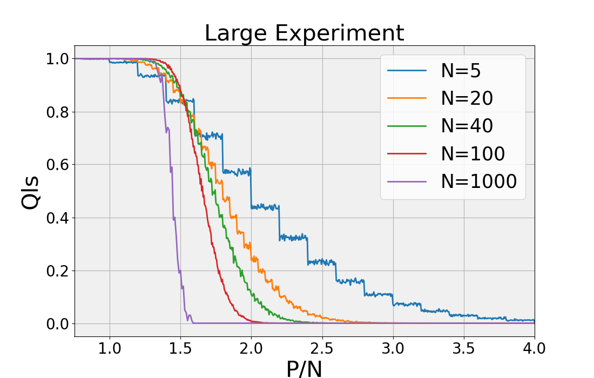

# Rosenblatt Perceptron Algorithm

This project demonstrates the implementation of the Rosenblatt perceptron training algorithm in Python, using the Numpy library for mathematical operations. To enhance the efficiency of the code, the Numba package is utilized to dynamically compile Python functions into optimized machine code.

Our approach comprises three key parts: 

1. Artificial Data Generation
2. Perceptron Model (Training)
3. Calculation of the fraction of successful runs `Q_{l.s.}`

---

## The Number of Linearly Separable Dichotomies

The primary results generated for this experiment pertain to the fraction of successful runs, denoted by `Q_{l.s.}`. A successful run is one where the algorithm manages to converge (i.e., `E^{v} > 0` for all `v`) within a set number of epochs (100). This fraction relates to `P_{ls}` from the lecture notes (equation 3.42), which is the fraction of linearly separable dichotomies. 

The `P_{ls}` can be calculated theoretically, but our goal is to find it experimentally as `Q_{l.s.}`.

---

## Artificial Data Generation

A dataset `D` is created, containing `P` randomly generated feature vectors `ξ`, each having a dimensionality of `N`. The components of individual feature vectors are drawn from a Gaussian distribution with zero mean and unit variance. Each feature vector is assigned a binary label `S`, which has an equal probability of being either -1 or 1.

```python
def generate_artificial_data(N, P):
    feature_vectors = [numpy.random.normal(0, 1, N) for _ in range(P)]
    labels = [numpy.choice([-1, 1]) for _ in range(P)]
    return feature_vectors, labels
```

## Perceptron Model
The Rosenblatt perceptron training algorithm is a crucial component of this project. Before training, all weights are initialized to zero. The perceptron is then trained over N_{max} sweeps, iterating over all samples ξ^{\mu} in the dataset.

For each sample, the local potential E^{\mu(t)} is calculated. The weights are then updated according to the local potential. The training process ends when the algorithm converges (E^{v} > 0 for all v in the dataset) or when the maximum number of sweeps N_{max} is completed.

## Results:


